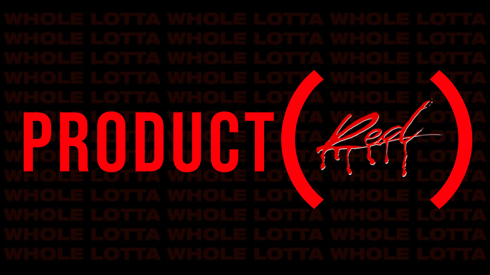

    <h1 style="font-size: 2.5em; color: #1a73e8; font-family: Arial, sans-serif;">🚨 SirDank's dank.tool 🚨</h1>
    
An all-in-one, installable Windows program with a wide variety of features built with Python!

    
<b>~ Visits ~</b>

    

    

    

    

    
This tool will rarely need to be updated as it executes the latest source code straight from GitHub for the <a href="https://github.com/SirDank/dank.tool/blob/main/__src__/dank.tool.py">tool</a> itself, its <a href="https://github.com/SirDank/dank.tool/tree/main/__modules__">modules</a>, and for <a href="https://github.com/SirDank/dank.tool/blob/main/__src__/updater.py">updates</a>!

    
Don't understand English? Don't worry! It even has a built-in translator that translates English to any language! (requires internet connection)

    
Uses <a href="https://github.com/SirDank/dankware">dankware</a>

    <h2 style="color: #1a73e8; font-family: Arial, sans-serif;">♦️ Download ♦️</h2>
    <ul style="list-style: none; padding: 0;">
        <li>ZIP Password: <code style="background-color: #282c34; color: #61dafb; padding: 2px 5px; border-radius: 3px;">dankware</code></li>
        <li>Direct Download: <a href="https://github.com/SirDank/dank.tool/raw/main/dank.tool.zip">Download</a></li>
        <li>Short Direct Download: <a href="https://bit.ly/dank-tool-zip">bit.ly/dank-tool-zip</a></li>
        <li>Short Github URL: <a href="https://bit.ly/dank-tool">bit.ly/dank-tool</a></li>
    </ul>

    <h2 style="color: #1a73e8; font-family: Arial, sans-serif;">♦️ Preview ♦️</h2>
    

    <h2 align="center" style="color: #1a73e8; font-family: Arial, sans-serif;">♦️ Notes ♦️</h2>
    <ul>
        <li>The executable does not have a verified certificate. Thus, Windows Defender may show a warning about it being from an unknown source (false positive).</li>
        <li>If you would like to run the Python scripts instead of the installer, there might be small changes you have to make for it to execute properly. (e.g., paths)</li>
        <li>Try not to spam the [ENTER] key on the exe's terminal as it can cause the program to take in the wrong input. If this occurs, close the exe and relaunch it.</li>
        <li>When the tool is running and performing a task, if you click inside the console window, a white rectangle appears and the task is paused. To continue performing the task, press the down arrow key.</li>
        <li>When the tool is selected (but text is not), do not use [Ctrl + C] as it will raise the `KeyboardInterrupt` exception and close the program.</li>
        <li>When on the main menu, you can resize the window to your preferred size and then enter `refresh` as input to re-align the UI.</li>
        <li>If you want the startup animation and music to be played on every run, enable `force-startup-audio` in settings.</li>
        <li>Do not enable `offline-src`, `offline-mode` or `dev-branch` in settings as they are only meant for developers.</li>
        <li>Documentation for developers can be found <a href="https://github.com/SirDank/dank.tool#-danktool-documentation--for-devs--">here</a>.</li>
    </ul>

    <h2 align="center" style="color: #1a73e8; font-family: Arial, sans-serif;">♦️ To Do ♦️</h2>
    <ul>
        <li>[x] Add offline mode for offline scripts ( High Priority )</li>
        <li>[x] Add translator</li>
        <li>[x] Finish reworking dank.downloader.py</li>
        <li>[ ] Linux / Wine support</li>
    </ul>

    <h2 align="center" style="color: #1a73e8; font-family: Arial, sans-serif;">♦️ Support ♦️</h2>
    <ul>
        <li><a href="https://allmylinks.com/link/out?id=kdib4s-nu8b-1e19god">Discord</a></li>
    </ul>

    <h2 align="center" style="color: #1a73e8; font-family: Arial, sans-serif;">♦️ Funding ♦️</h2>
    
I do not take any donations, but if you would like to support the growth of this tool, you can donate to <a href="https://www.buymeacoffee.com/SirDank">BuyMeACoffee</a> to help me with the cost of servers and development time.

    <h2 style="color: #1a73e8; font-family: Arial, sans-serif;">♦️ For Developers ♦️</h2>
    <ul>
        <li>When contributing, try to follow the PEP-8 coding style guide.</li>
        <li>Fork the repository, make your changes, and then submit a pull request.</li>
        <li>Check for existing issues and try to address them before creating new ones.</li>
    </ul>

    <h2 align="center" style="color: #1a73e8; font-family: Arial, sans-serif;">♦️ License ♦️</h2>
    
This project is licensed under the MIT License - see the <a href="https://github.com/SirDank/dank.tool/blob/main/LICENSE">LICENSE</a> file for details.

    <h2 style="color: #1a73e8; font-family: Arial, sans-serif;">♦️ Anonymous Suggestions ♦️</h2>
    
<a href="https://dank-site.onrender.com/dank-tool-suggestions">Suggest new modules for the dank.tool!</a>

&nbsp;

    <h1 style="color: #ff3b30; font-family: Arial, sans-serif;">🚨 Most Advanced Minecraft Server Builder 🚨</h1>
    
A complete package for building and hosting a fully optimised minecraft purpur server on your local Windows/Linux system without port-forwarding!

   <h2 style="color: #1a73e8; font-family: Arial, sans-serif;">♦️ Features ♦️</h2>
   <ul>
        <li>Customization for server name, <a href="https://github.com/PurpurMC/Purpur">purpur</a> version, server ram, allowing cracked players.</li>
        <li>Multithreaded file downloader (2 threads)</li>
        <li>Uses <a href="https://github.com/Osiris-Team/AutoPlug-Client">AutoPlug</a> for updating jdk / plugins / server jar and much more!</li>
        <li>Uses <a href="https://github.com/playit-cloud/playit-agent">playit.gg</a> as the hosting solution</li>
        <li>Downloads <a href="https://github.com/PurpurMC/Purpur">purpur</a> of the selected minecraft version</li>
        <li>Downloads several plugins from <a href="https://github.com/search?q=repo%3ASirDank%2Fdank.tool+%22spigot_plugins+%3D+%7B%22&type=code">spigot</a> / <a href="https://github.com/search?q=repo%3ASirDank%2Fdank.tool+%22github+plugins%22&type=code">github</a></li>
        <li>Downloads <a href="https://www.spigotmc.org/resources/spigot-anti-malware.64982/">minecraft anti-malware</a></li>
        <li>Applies <a href="https://help.minecraft.net/hc/en-us/articles/4416199399693-Security-Vulnerability-in-Minecraft-Java-Edition">Log4j</a> exploit patches automatically</li>
        <li>Creates scripts for starting the server with respect to <a href="https://aikar.co/2018/07/02/tuning-the-jvm-g1gc-garbage-collector-flags-for-minecraft/">Aikar's Flags</a> and <a href="https://github.com/etil2jz/etil-minecraft-flags">Etil's Flags</a></li>
        <li>Creates scripts to quickly install java, perform malware scan</li>
        <li>Configures <a href="https://github.com/Osiris-Team/AutoPlug-Client">AutoPlug</a> automatically (for the plugins downloaded by the server builder)</li>
        <li>Applies most optimizations from <a href="https://github.com/YouHaveTrouble/minecraft-optimization">here</a> automatically</li>
        <li>Integrated with dank.tool's chatroom via the <a href="https://github.com/SirDank/dank.chatroom-plugin">dank.chatroom-plugin</a></li>
  </ul>

   <h2 style="color: #1a73e8; font-family: Arial, sans-serif;">♦️ To Do ♦️</h2>
   <ul>
        <li>[x] Add Iris Dimensions (newhorizons / theend)</li>
        <li>[x] Add ViaVersion / ViaBackwards / ViaRewind</li>
        <li>[ ] Add datapacks (based on mc version)</li>
        <li>[ ] Add GeyserMC / Floodgate Options</li>
        <li>[ ] Add Mohist / Banner Options</li>
        <li>[ ] Add simple / advanced modes (full rework)</li>
        <li>[ ] Maybe add a super simple web panel to only display stats</li>
   </ul>

  <h2 style="color: #1a73e8; font-family: Arial, sans-serif;">♦️ History ♦️</h2>
  
Beginnings of dank.serverbuilder (dsb actually started out as a simple batch script) > <a href="https://github.com/SirDank/dank.serverbuilder">old version</a>

   <h2 style="color: #1a73e8; font-family: Arial, sans-serif;">♦️ Preview ♦️</h2>
  

  <h2 style="color: #1a73e8; font-family: Arial, sans-serif;">♦️ Youtube ♦️</h2>
   

&nbsp;

    <h1 style="color: #ff3b30; font-family: Arial, sans-serif;">🚨 Minecraft Server Scanner 🚨</h1>
    
A super-fast Minecraft server scanner to find random servers around the world! [ 493/s ~ 500 threads ~ 100K IPs ~ 3 minutes 35 seconds ~ Ryzen 7 5800H Mobile ]

    <ul>
        <li>Generates the specified amount of IPs and scans the default Minecraft server port 25565 (java) / 19132 (bedrock)</li>
        <li>IPs are crafted in such a way that it is unique and avoids IPs that aren't valid / local IPs / will not have mc servers hosted on them</li>
        <li>Prints server info including IP, version, number of players online, latency in ms, host city, host org, host domain, server description (gamemode, map, motd on bedrock)</li>
        <li>You automatically contribute to the minecraft <a href="https://dank-site.onrender.com/minecraft-java-servers">java</a> and <a href="https://dank-site.onrender.com/minecraft-bedrock-servers">bedrock</a> server lists by scanning!</li>
    </ul>

   <h2 style="color: #1a73e8; font-family: Arial, sans-serif;">♦️ To Do ♦️</h2>
   <ul>
        <li>[x] Add targeted scans (for specific IPs / ranges)</li>
        <li>[ ] Use masscan for windows</li>
   </ul>

   <h2 style="color: #1a73e8; font-family: Arial, sans-serif;">♦️ Preview ♦️</h2>
  

  <h2 style="color: #1a73e8; font-family: Arial, sans-serif;">♦️ Also check out dank.resource-pack! ♦️</h2>
   
<a href="https://github.com/SirDank/dank.resource-pack">https://github.com/SirDank/dank.resource-pack</a>

&nbsp;

    <h1 style="color: #ff3b30; font-family: Arial, sans-serif;">🚨 SpotX + Spicetify Installer 🚨</h1>
    
Full credits to <a href="https://github.com/SpotX-Official/SpotX">amd64fox</a> and <a href="https://github.com/spicetify/spicetify-cli">spicetify</a>!

    
This tool will install and configure <a href="https://github.com/SpotX-Official/SpotX">SpotX</a> and <a href="https://github.com/spicetify/spicetify-cli">Spicetify</a> with your desired settings in just a few clicks!

  <h2 style="color: #1a73e8; font-family: Arial, sans-serif;">♦️ Features ♦️</h2>
  <ul>
        <li>Install and configure SpotX and Spicetify automatically</li>
        <li>Provide options for various configurations and themes</li>
  </ul>

  <h2 style="color: #1a73e8; font-family: Arial, sans-serif;">♦️ To Do ♦️</h2>
  <ul>
        <li>[x] Basic installer and configuration</li>
        <li>[ ] Advanced configuration options</li>
  </ul>

  <h2 style="color: #1a73e8; font-family: Arial, sans-serif;">♦️ Preview ♦️</h2>
  

&nbsp;

    <h1 style="color: #ff3b30; font-family: Arial, sans-serif;">🚨 Dank Tools 💎</h1>
    
This tool is a complete package for automating various tasks related to Minecraft servers, SpotX, Spicetify, and more. Explore the individual tools for more details.

  <h2 style="color: #1a73e8; font-family: Arial, sans-serif;">♦️ Overview ♦️</h2>
    <ul>
        <li><a href="https://dank-site.onrender.com/dank-tool-suggestions">Anonymous Suggestions</a></li>
        <li><a href="https://dank-site.onrender.com/minecraft-java-servers">Minecraft Server Scanner</a></li>
        <li><a href="https://github.com/SirDank/dank.resource-pack">dank.resource-pack</a></li>
        <li><a href="https://github.com/SpotX-Official/SpotX">SpotX + Spicetify Installer</a></li>
  </ul>

  <h2 style="color: #1a73e8; font-family: Arial, sans-serif;">♦️ Contact & Feedback ♦️</h2>
  
If you have any feedback or suggestions, feel free to <a href="mailto:support@dank-site.onrender.com">email us</a> or submit them via our <a href="https://dank-site.onrender.com/dank-tool-suggestions">suggestion form</a>.

